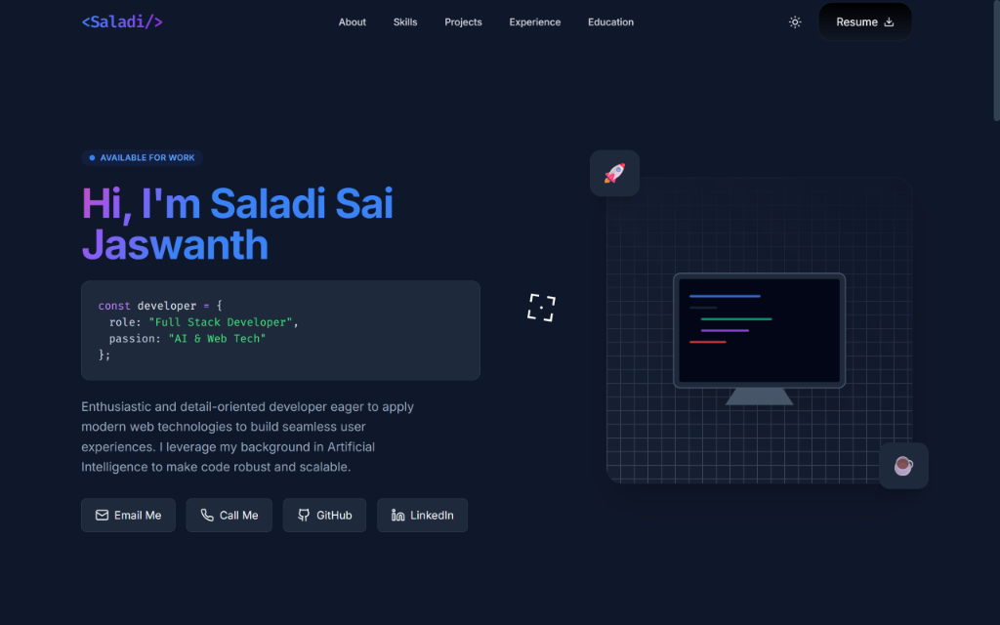

# 🚀 Saladi Sai Jaswanth - Portfolio

A modern, animated portfolio website built with **Next.js 15**, **Bun**, and **TailwindCSS**, showcasing my work as a Full Stack Developer specializing in AI & Web Technologies.

[](https://portfolio-sai-jaswanth.vercel.app/)
[](https://opensource.org/licenses/MIT)
[](https://nextjs.org/)
[](https://bun.sh/)



## 🌐 Live Demo

**Visit the live portfolio**: [https://portfolio-sai-jaswanth.vercel.app/](https://portfolio-sai-jaswanth.vercel.app/)

## ✨ Features

### 🎨 Design & Animations
- **Shiny Text Animation** - Colorful gradient text animation from [React Bits](https://reactbits.dev)
- **Custom Cursor** - Interactive target cursor with corner brackets animation
- **Star Border Buttons** - Animated star gradient borders on CTA buttons
- **Dark/Light Mode** - Persistent theme with smooth transitions
- **Glassmorphism Effects** - Modern glass-card UI components
- **Smooth Animations** - Powered by Framer Motion

### 🛠️ Technical Features
- **Next.js 15** with App Router
- **React 19** with Server Components
- **Bun Runtime** for blazing-fast performance
- **TypeScript** for type safety
- **TailwindCSS** for styling
- **GSAP** for advanced cursor animations
- **Fully Responsive** - Mobile, tablet, and desktop optimized
- **SEO Optimized** - Proper meta tags and semantic HTML

### 📦 Sections
- **Hero** - Introduction with animated name and social links
- **Skills** - Technical skills categorized by expertise
- **Projects** - Featured projects with GitHub/GitLab links
- **Experience** - Work experience and certifications with downloadable certificates
- **Education** - Academic background and publications
- **Footer** - Copyright and credits

## 🚀 Quick Start

### Prerequisites
- [Bun](https://bun.sh/) installed on your system
- Node.js 18+ (optional, for compatibility)

### Installation

```bash
# Clone the repository
git clone https://github.com/SaiJaswanth17/Portfolio_Sai_Jaswanth.git

# Navigate to project directory
cd Portfolio_Sai_Jaswanth

# Install dependencies
bun install

# Start development server
bun run dev
```

Open [http://localhost:3000](http://localhost:3000) to view the portfolio.

## 📝 Development

```bash
# Start development server
bun run dev

# Build for production
bun run build

# Start production server
bun run start

# Run linting
bun run lint
```

## 🎨 Customization

### Update Your Information

Edit `lib/constants.ts` to customize:
- **NAV_LINKS** - Navigation menu items
- **SKILLS** - Your technical skills
- **PROJECTS** - Featured projects with links
- **EXPERIENCE** - Work experience and certifications
- **EDUCATION** - Educational background
- **PUBLICATION** - Research publications or patents
- **SOCIAL_LINKS** - Email, phone, GitHub, LinkedIn, resume

### Change Theme Colors

Edit `tailwind.config.ts` to modify:
- Color palette (primary, dark mode colors)
- Custom animations
- Font families
- Spacing and breakpoints

### Add/Remove Sections

Edit `app/page.tsx` to add or remove sections from the portfolio.

## 🌐 Deployment

### Vercel (Recommended)

1. Push your code to GitHub
2. Import your repository in [Vercel](https://vercel.com)
3. Vercel will automatically detect Next.js
4. Set environment variables (if needed):
   - `GEMINI_API_KEY` (optional)
5. Deploy!

### Other Platforms

- **Netlify**: Use `bun run build` and deploy `.next` directory
- **Railway/Render**: Set build command to `bun run build` and start command to `bun run start`

## 📂 Project Structure

```
├── app/
│   ├── layout.tsx          # Root layout with theme provider
│   ├── page.tsx             # Main landing page
│   └── globals.css          # Global styles
├── components/
│   ├── Navbar.tsx           # Navigation with star border button
│   ├── Hero.tsx             # Hero section with shiny text
│   ├── Skills.tsx           # Skills showcase
│   ├── Projects.tsx         # Featured projects
│   ├── Experience.tsx       # Work experience with certificates
│   ├── Education.tsx        # Education & publications
│   ├── Footer.tsx           # Footer component
│   ├── ThemeProvider.tsx    # Dark mode provider
│   ├── ShinyText.tsx        # Text animation component
│   ├── StarBorder.tsx       # Button border animation
│   └── TargetCursor.tsx     # Custom cursor animation
├── lib/
│   ├── constants.ts         # App constants & data
│   └── types.ts             # TypeScript types
└── public/                  # Static assets
```

## 🎯 React Bits Components

This portfolio uses premium animated components from [React Bits](https://reactbits.dev):
- **Shiny Text** - Animated gradient text
- **Target Cursor** - Interactive cursor with corner brackets
- **Star Border** - Animated star gradient borders

## 📄 License

This project is open source and available under the [MIT License](LICENSE).

## 🤝 Contact

- **Email**: [saijaswanth1728@gmail.com](mailto:saijaswanth1728@gmail.com)
- **Phone**: +91 9014978288
- **GitHub**: [@SaiJaswanth17](https://github.com/SaiJaswanth17)
- **LinkedIn**: [Sai Jaswanth](https://www.linkedin.com/in/sai-jaswanth-a78110302/)

## 🙏 Acknowledgments

- Design inspiration from modern portfolio trends
- Animations from [React Bits](https://reactbits.dev)
- Built with [Next.js](https://nextjs.org/), [Bun](https://bun.sh/), and [TailwindCSS](https://tailwindcss.com/)

---

**Made with ❤️ by Saladi Sai Jaswanth**
